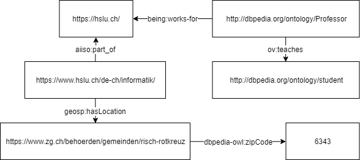

# Testatübung SW02

## Aufgabe 1

## Aufgabe 2

### Anwendungsfall für Knowledge Graphen

*Analyse von eigenem Streaming-Server*

Eine Person X betreibt einen eigenen Streamingserver und erstellt Accounts für Kollegen. Die Daten die dabei entstehen, können mithilfe
eines Knowledge Graphs modelliert werden. Zusätzlich wäre es interessant, gewisse Attribute der Kollegen mit einzubinden.
Folgende Daten sind interessant:

* Benutzer
    * Alter
    * Beruf
    * Zivilstand
    * Geschlecht
    * Herkunft
* Film-Portfolio
    * Genre des Films
    * Inhalt / Handlung
    * Schauspieler des Films
    * Internationales Ranking (IMDb)

### Resultierende Vorteile

Durch einen Knowledge Graph können die folgenden Punkte analysiert werden:

* Welche Genres sind beliebt?
* Welche Handlungen sind beliebt?
* Welche Schauspieler werden gerne gesehen?
* Welche Relationen unter den Kollegen gibt es?
* Interessen-Aufteilung anhand der Benutzer Attribute

Somit kann zum Beispiel im Vornherein analysiert werden, wer einen Film vermutlich schauen wird;
somit können die Prioritäten besser gesetzt werden.
Ausserdem können mit den Daten die Bandbreite und die Zeit für Wartungsarbeiten besser definiert werden.
