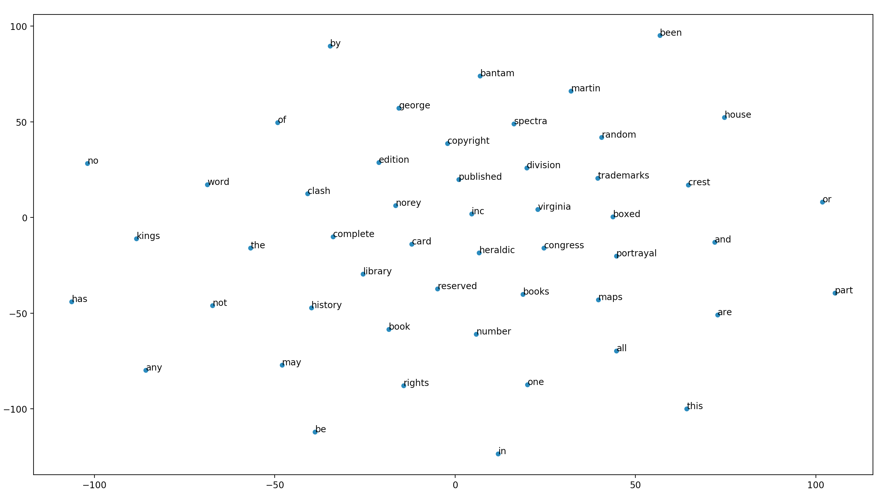

# Testatübung SW06

## Aufgabe 1
Erstellen Sie für das GOT Model eine 2D Visualisierung von 50 Begriffen

Generiertes Bild:

## Aufgabe 2
Für Game of Thrones soll eine spezifische Wissensdatenbank zu den genutzten Waffen erstellt werden. Wie würden sie die
Konzeptextraktion vornehmen? (Vorgehen kurz erläutern)
